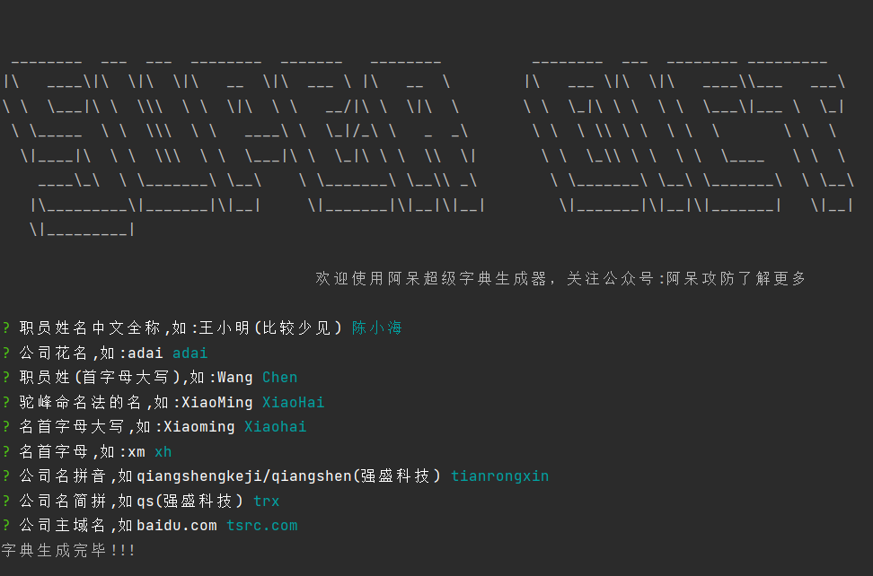

# Super-Password-Dict 阿呆超级密码字典
**郑重声明：文中所涉及的技术、思路和工具仅供以安全为目的的学习交流使用，<u>任何人不得将其用于非法用途以及盈利等目的，否则后果自行承担</u>** 。
<p align="center"><a href="https://opensource.org/licenses/MIT"></a><a href="https://github.com/z-bool/super-password-dict"></a></p>

<p align="center"><a href="#install">模块打包</a> · <a href="#tall">使用说明</a> · <a href="#notice">字典规则</a> · <a href="#communicate">技术交流</a></p>

<div id="install"></div>
### 模块打包
```bash
go mod tidy # 安装依赖库
go build .
```
如果没有二开或自行打包需要的，可以直接从release下载打包好的文件即可
<div id= "tall"></div>
### 使用说明
此项目的开发初衷是在渗透测试过程中没有突破点时，可以根据信息收集下的密码生成字典来进行登录爆破，寻找新的突破口。这里是通过命令行输入生成所需要的参数来生成一个全面的字典。
<p>这里我们来看一下参数，这里我们看看图：</p>
<div></div>
- 职员姓名中文全称,如:王小明(比较少见) 【陈小海】     (中文名字+弱口令爆破)
- 公司花名,如:adai 【adai】     (小大写随便因为处理时候只有小写)
- 职员姓(首字母大写),如:Wang 【Chen】     (要求姓首字母是大写，后续小写处理代码处理)
- 驼峰命名法的名,如:XiaoMing 【XiaoHai】    (要求驼峰格式，下面名后面的小写因为代码不能区分断词断在何处)
- 名首字母大写,如:Xiaoming 【Xiaohai】     (要求名首字母大写，其余小写即可)
- 名首字母,如:xm 【xh】          (要求名的缩写，大小写不限制)
- 公司名拼音,如qiangshengkeji/qiangshen(强盛科技) 【tianrongxin】    (大小写不限制，如果公司名的拼音与根域名去掉.com这样的后缀一样的话，这个留空免得生成重复)
- 公司名简拼,如qs(强盛科技) 【trx】       (公司名简拼, 大小写随意，此处代码没做处理，自己视情况而定)
- 公司主域名,如baidu.com 【tsrc.com】     (输入一级域名即根域即可)
<div id="notice"></div>
### 字典规则
<ul>

<li>姓名全拼(小写) + 弱口令</li>
<li>姓名全拼(小写) + "@/#" + 弱口令</li>
<li>姓名全拼(小写) + 域名 ( + "!#." )</li>
<li>姓名全拼(小写) + "@/#" + 域名 ( + 弱口令 +"!#." )</li>
<li>姓名全拼(小写) + 域名前缀 ( + 弱口令 + "!#." )</li>
<li>姓名全拼(小写) + "@/#" + 域名前缀 ( + 弱口令 + "!#." )</li>
<li>姓名全拼(小写) + 公司全拼(小写) +  ( + 弱口令+ "!#." )</li>
<li>姓名全拼(小写) + "@/#" + 公司全拼(小写) ( + 弱口令+ "!#." )</li>
<li>姓名全拼(小写) + 公司简拼(用户决定) ( + 弱口令+ "!#." )</li>
<li>姓名全拼(小写) + "@/#"+ 公司简拼(用户决定) ( + 弱口令 + "!#." )</li>
<li>姓全称(首字母大写) + 名缩写(大小写各一次) + 弱口令</li>
<li>姓全称(首字母大写) + "@/#" + 名缩写(大小写各一次)  + 弱口令</li>
<li>姓全称(首字母大写) + 名缩写(大小写各一次) + 域名 ( + "!#." )</li>
<li>姓全称(首字母大写) + 名缩写(大小写各一次) + "@/#" + 域名 ( + 弱口令 +"!#." )</li>
<li>姓全称(首字母大写) + 名缩写(大小写各一次) + 域名前缀 ( + 弱口令 + "!#." )</li>
<li>姓全称(首字母大写) + 名缩写(大小写各一次) + "@/#" + 域名前缀 ( + 弱口令 + "!#." )</li>
<li>姓全称(首字母大写) + 名缩写(大小写各一次) + 公司全拼(小写) +  ( + 弱口令+ "!#." )</li>
<li>姓全称(首字母大写) + 名缩写(大小写各一次) + "@/#" + 公司全拼(小写) ( + 弱口令+ "!#." )</li>
<li>姓全称(首字母大写) + 名缩写(大小写各一次) + 公司简拼(用户决定) ( + 弱口令+ "!#." )</li>
<li>姓全称(首字母大写) + 名缩写(大小写各一次) + "@/#"+ 公司简拼(用户决定) ( + 弱口令 + "!#." )</li>
<li>姓全称(小写) + 名缩写(大小写各一次) + 弱口令 </li>
<li>姓全称(小写) + 名缩写(大小写各一次) + "@/#" + 弱口令</li>
<li>姓全称(小写) + 名缩写(大小写各一次) + 域名 ( + 弱口令 + "!#." )</li>
<li>姓全称(小写) + 名缩写(大小写各一次) + "@/#" + 域名 ( + 弱口令 +"!#." )</li>
<li>姓全称(小写) + 名缩写(大小写各一次) + 域名前缀 ( + 弱口令 + "!#." )</li>
<li>姓全称(小写) + 名缩写(大小写各一次) + "@/#" + 域名前缀 ( + 弱口令 + "!#." )</li>
<li>姓全称(小写) + 名缩写(大小写各一次) +  ( + 弱口令+ "!#." )</li>
<li>姓全称(小写) + 名缩写(大小写各一次) + "@/#" + 公司全拼(小写) ( + 弱口令+ "!#." )</li>
<li>姓全称(小写) + 名缩写(大小写各一次) ( + 弱口令+ "!#." )</li>
<li>姓全称(小写) + 名缩写(大小写各一次) + "@/#"+ 公司简拼(用户决定) ( + 弱口令 + "!#." )</li>
<li>姓简称(大写) + 名全称(小写) + 弱口令</li>
<li>姓简称(大写) + 名全称(小写) + "@/#" + 弱口令</li>
<li>姓简称(大写) + 名全称(小写) + 域名 ( + "!#." )</li>
<li>姓简称(大写) + 名全称(小写) + "@/#" + 域名 ( + 弱口令 +"!#." )</li>
<li>姓简称(大写) + 名全称(小写) + 域名前缀 ( + 弱口令 + "!#." )</li>
<li>姓简称(大写) + 名全称(小写) + "@/#" + 域名前缀 ( + 弱口令 + "!#." )</li>
<li>姓简称(大写) + 名全称(小写) + 公司全拼(小写) +  ( + 弱口令+ "!#." )</li>
<li>姓简称(大写) + 名全称(小写) + "@/#" + 公司全拼(小写) ( + 弱口令+ "!#." )</li>
<li>姓简称(大写) + 名全称(小写) + 公司简拼(用户决定) ( + 弱口令+ "!#." )</li>
<li>姓简称(大写) + 名全称(小写) + "@/#"+ 公司简拼(用户决定) ( + 弱口令 + "!#." )</li>
<li>姓简称(小写) + 名全称(小写) + 弱口令</li>
<li>姓简称(小写) + 名全称(小写) + "@/#" + 弱口令</li>
<li>姓简称(小写) + 名全称(小写) + 域名 ( + "!#." )</li>
<li>姓简称(小写) + 名全称(小写) + "@/#" + 域名 ( + 弱口令 +"!#." )</li>
<li>姓简称(小写) + 名全称(小写) + 域名前缀 ( + 弱口令 + "!#." )</li>
<li>姓简称(小写) + 名全称(小写) + "@/#" + 域名前缀 ( + 弱口令 + "!#." )</li>
<li>姓简称(小写) + 名全称(小写) + 公司全拼(小写) +  ( + 弱口令+ "!#." )</li>
<li>姓简称(小写) + 名全称(小写) + "@/#" + 公司全拼(小写) ( + 弱口令+ "!#." )</li>
<li>姓简称(小写) + 名全称(小写) + 公司简拼(用户决定) ( + 弱口令+ "!#." )</li>
<li>姓简称(小写) + 名全称(小写) + "@/#"+ 公司简拼(用户决定) ( + 弱口令 + "!#." )</li>
<li>域名 + "@/#" + 姓名全拼(小写) ( + 弱口令 +"!#." )</li>
<li>域名 + "@/#" + 姓全称(首字母大写) ( + 弱口令 +"!#." )</li>
<li>域名 + "@/#" + 姓全称(小写) ( + 弱口令 +"!#." )</li>
<li>域名 + "@/#" + 姓简称(小写) + 名全称(小写) ( + 弱口令 +"!#." )</li>
<li>域名 + "@/#" + 姓简称(大写) + 名全称(小写) ( + 弱口令 +"!#." )</li>
<li>域名前缀 + "@/#" + 姓名全拼(小写) ( + 弱口令 +"!#." )</li>
<li>域名前缀 + "@/#" + 姓全称(首字母大写) ( + 弱口令 +"!#." )</li>
<li>域名前缀 + "@/#" + 姓全称(小写) ( + 弱口令 +"!#." )</li>
<li>域名前缀 + "@/#" + 姓简称(小写) + 名全称(小写) ( + 弱口令 +"!#." )</li>
<li>域名前缀 + "@/#" + 姓简称(大写) + 名全称(小写) ( + 弱口令 +"!#." )</li>
<li>公司全拼(小写) + "@/#" + 姓名全拼(小写) ( + 弱口令 +"!#." )</li>
<li>公司全拼(小写) + "@/#" + 姓全称(首字母大写) ( + 弱口令 +"!#." )</li>
<li>公司全拼(小写) + "@/#" + 姓全称(小写) ( + 弱口令 +"!#." )</li>
<li>公司全拼(小写) + "@/#" + 姓简称(小写) + 名全称(小写) ( + 弱口令 +"!#." )</li>
<li>公司全拼(小写) + "@/#" + 姓简称(大写) + 名全称(小写) ( + 弱口令 +"!#." )</li>
<li>公司简拼(用户决定)  + "@/#" + 姓名全拼(小写) ( + 弱口令 +"!#." )</li>
<li>公司简拼(用户决定)  + "@/#" + 姓全称(首字母大写) ( + 弱口令 +"!#." )</li>
<li>公司简拼(用户决定)  + "@/#" + 姓全称(小写) ( + 弱口令 +"!#." )</li>
<li>公司简拼(用户决定)  + "@/#" + 姓简称(小写) + 名全称(小写) ( + 弱口令 +"!#." )</li>
<li>公司简拼(用户决定)  + "@/#" + 姓简称(大写) + 名全称(小写) ( + 弱口令 +"!#." )</li>
<li>域名 + 弱口令 ( + "!#." )</li>
<li>域名前缀 + 弱口令 ( + "!#." )</li>
<li>公司全拼(小写) + 弱口令 ( + "!#." )</li>
<li>公司简拼(用户决定) + 弱口令 (+ "!#." )</li>
</ul>
<div id="communicate"></div>

### 技术交流


微信群有过期时间限制，如果有技术交流、BUG解决、环境安装问题都可以于公众号/QQ群获取微信群信息(本来上新机器人管理推送解密这些功能的，但是用的Golang的SDK被微信监控了要封号就没上，加群公众号询问看到我就回复)。

 
